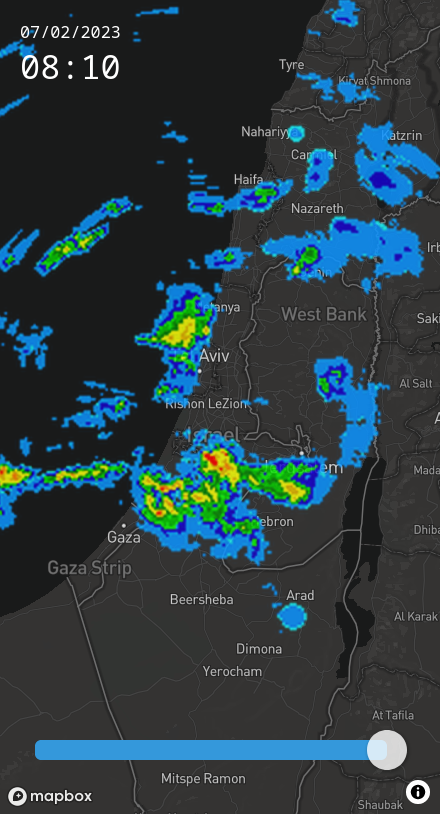

# Geshem 🌧️



An interactive rain radar clone running on Mapbox GL, see it live at: [https://geshem.space](https://geshem.space)

The entire service is served off of static assets located in S3 buckets:

- A static main index page, React-based JS bundle and other static assets that are uploaded upon deploy
- Radar images that are collected and indexed every minute by a Python recurring task running on AWS Lambda

For some architectural notes on the deployment process go read https://yuv.al/blog/an-architecture-for-periodically-updating-static-websites/

## Prerequisites

- Node.js
- NPM

## Dev

Install dependencies and run dev server:

```bash
$ npm install
$ npm run dev
```

### Deploy

Deployment is handled transparently on Cloudflare Workers.
